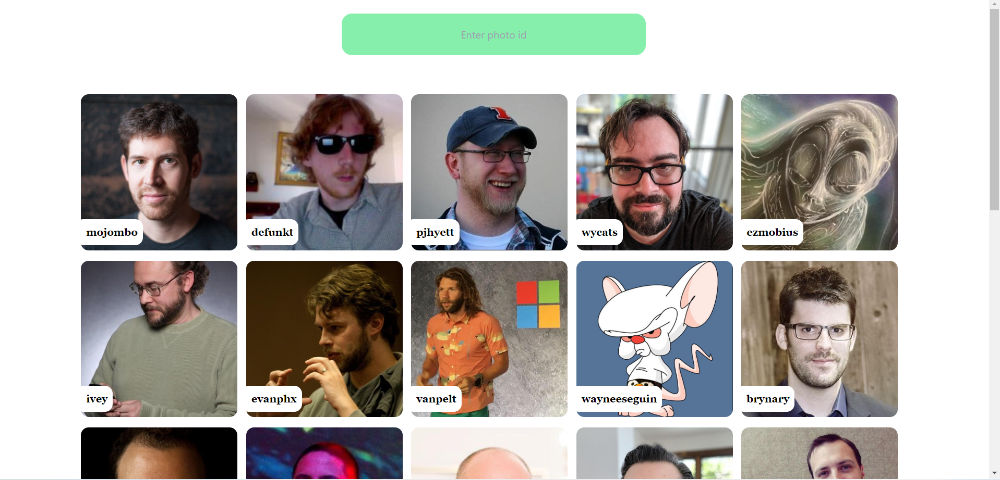
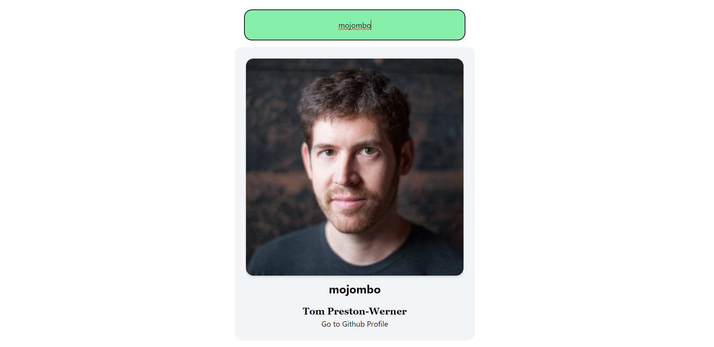

To run this project locally --

1. Clone this project.

2. Go to directory of the project and do `npm install` to install all dependencies.

3. then to run the project `npm run dev`

....
this is Home screen

and after searching a profile

